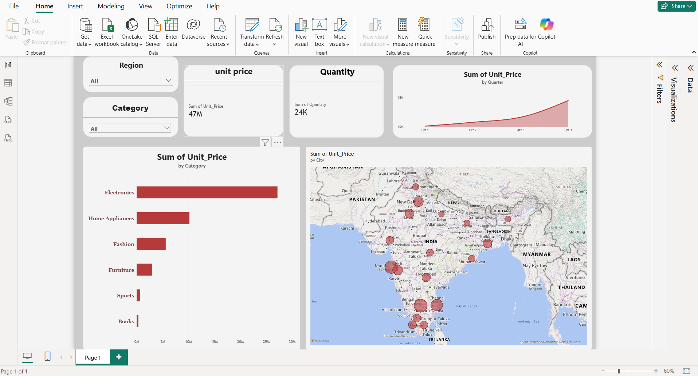

# E-Commerce Sales Performance Dashboard

A portfolio-ready, end-to-end Data Analyst project: SQL database design →
Advanced Excel analysis → Python EDA → Power BI dashboard, all built and
validated on a real 25-row transactional dataset, with a documented path to
scale to 10,000+ records without changing the analysis architecture.
## 📊 Dashboard Preview

## Project Structure
```
ecommerce-sales-performance/
├── data/
│   ├── ecommerce_data.csv                    # Original 25-row prototype source data
│   ├── ecommerce_data_enriched.csv           # Prototype + calculated fields
│   ├── ecommerce_data_10000.csv              # Scaled 10,000-row synthetic dataset
│   └── ecommerce_data_10000_enriched.csv     # Scaled + calculated fields
├── sql/
│   ├── 01_schema.sql                   # Star-schema DDL (dim_customers, dim_products, fact_orders)
│   ├── 02_insert_data.sql              # Generated INSERT statements (25-row prototype)
│   ├── 03_analysis_queries.sql         # 17 validated KPI/analytical queries (run at BOTH scales)
│   ├── ecommerce.db                    # Built & populated SQLite database — 25 rows
│   └── ecommerce_10000.db              # Built & populated SQLite database — 10,000 rows
├── excel/
│   ├── build_workbook.py                       # Generates the 25-row workbook (openpyxl)
│   ├── Ecommerce_Sales_Analysis.xlsx           # 25-row workbook: 5 sheets, 318 formulas
│   ├── build_workbook_10000.py                 # Generates the 10,000-row workbook
│   └── Ecommerce_Sales_Analysis_10000.xlsx     # 10,000-row workbook: 5 sheets, 5,543 formulas
├── python/
│   ├── analysis.py                        # 25-row: cleaning, EDA, 9 analysis sections
│   ├── insights_output.txt                # Captured console output — 25 rows
│   ├── generate_10000_dataset.py          # Synthetic 10,000-row dataset generator
│   ├── build_10000_db.py                  # Bulk-loads the 10,000-row SQLite database
│   ├── analysis_10000.py                  # Same analysis, run at 10,000-row scale
│   └── insights_output_10000.txt          # Captured console output — 10,000 rows
├── powerbi/
│   ├── DAX_Measures.txt                # All DAX measures, ready to paste into Power BI
│   └── PowerBI_Build_Guide.md          # Data model, 4-page layout, slicers, theme, build steps
├── screenshots/                        # 7 charts (25-row) + 9 charts (10k, prefixed 10k_)
├── documentation/
│   ├── Business_Insights.md            # 7 insights from the 25-row prototype
│   ├── Business_Insights_10000.md      # 8 insights from the 10,000-row dataset, incl.
│   │                                    #   where scale CHANGED a prototype conclusion
│   ├── Scaling_Plan.md                 # How 25 rows → 10,000 rows was actually done
│   └── Interview_Prep.md               # Resume bullet + 65 interview questions
└── README.md
```

## Two Deliverables, One Architecture
This project was built in two stages, both fully working end-to-end:
1. **25-row prototype** — proves the schema, queries, formulas, and Python
   logic are all correct on a small, hand-checkable dataset.
2. **10,000-row scaled dataset** — a realistic synthetic dataset (see
   `documentation/Scaling_Plan.md` for exact methodology: weighted category/
   region/payment distributions matching the prototype, a 900-customer pool
   with power-law repeat-purchase behavior, Fashion-skewed returns,
   evening-clustered order times, full-year date range) run through the
   **identical** schema, SQL queries, Excel formula patterns, and Python
   analysis — with zero architecture changes required.

## Dataset
**Prototype:** 25 e-commerce orders (Jan 3–27, 2026), 21 columns.
**Scaled:** 10,000 e-commerce orders (Jan 1 – Dec 31, 2026), same 21 columns,
893 unique customers, 41 unique products across the same 6 categories.

## Key Results — 10,000-Row Scaled Dataset
(validated identically across SQL, Excel, and Python)
| KPI | Value |
|---|---|
| Total Revenue | ₹9,70,78,858.70 |
| Total Profit | ₹2,11,82,258.04 |
| Profit Margin | 21.82% |
| Total Orders | 10,000 (9,462 delivered, 538 cancelled) |
| Average Order Value | ₹10,259.87 |
| Unique Customers | 893 |
| Conversion Rate | 94.62% |
| Return Rate | 8.36% |
| Top Category (Revenue) | Electronics — ₹5.62 Cr (58%) |
| Top Region | South — ₹4.16 Cr (43%) |
| Peak Order Hour | 20:00 (1,295 orders) |
| Returning-Customer Revenue Share | 91% (8,628 of 9,462 orders) |

Full analysis and business recommendations, including where the 10,000-row
results **changed** a prototype conclusion:
[`documentation/Business_Insights_10000.md`](documentation/Business_Insights_10000.md).
(Prototype-scale insights: [`documentation/Business_Insights.md`](documentation/Business_Insights.md).)

## How to Reproduce
```bash
# ---- 25-row prototype ----
sqlite3 sql/ecommerce.db < sql/01_schema.sql
sqlite3 sql/ecommerce.db < sql/02_insert_data.sql
sqlite3 sql/ecommerce.db < sql/03_analysis_queries.sql
cd excel && python3 build_workbook.py && cd ..
cd python && python3 analysis.py && cd ..

# ---- 10,000-row scaled dataset ----
cd python
python3 generate_10000_dataset.py   # writes data/ecommerce_data_10000.csv
python3 build_10000_db.py           # bulk-loads sql/ecommerce_10000.db + integrity checks
python3 analysis_10000.py           # EDA + 9 charts (prefixed 10k_) + insights_output_10000.txt
cd ../excel && python3 build_workbook_10000.py  # Ecommerce_Sales_Analysis_10000.xlsx

# ---- SQL queries work unchanged against either database ----
sqlite3 sql/ecommerce_10000.db < ../sql/03_analysis_queries.sql

# ---- Power BI ----
# See powerbi/PowerBI_Build_Guide.md — import data/ecommerce_data_10000_enriched.csv,
# paste measures from powerbi/DAX_Measures.txt, build the 4 pages as specified.
```

## Tech Stack
SQL (window functions, CTEs, joins, CASE) · Advanced Excel (SUMIFS, COUNTIFS,
IFS, INDEX/MATCH, Pivot-style summaries, Pivot Charts, date functions) ·
Python (pandas, NumPy, Matplotlib) · Power BI (DAX, star schema, 4-page
report, synced slicers)

## Scaling to Production Volume
This prototype's schema, SQL queries, Excel formulas, Python logic, and DAX
measures are all row-count agnostic — see
[`documentation/Scaling_Plan.md`](documentation/Scaling_Plan.md) for the
exact approach to generating and validating a realistic 10,000+ row
transactional dataset on the same architecture.

## Resume & Interview Prep
See [`documentation/Interview_Prep.md`](documentation/Interview_Prep.md) for
a ready-to-use resume project description plus 65 interview questions
(SQL, Excel, Power BI/DAX, Python, and project-specific).
